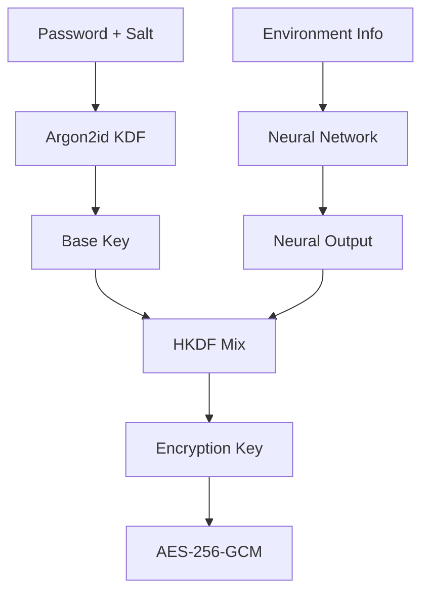

# 📚 CortexCrypt Technical Documentation

**Deep dive into neural-augmented encryption architecture, APIs, and implementation details.**

## 🧠 Core Concepts

### Neural-Augmented Encryption

CortexCrypt doesn't replace proven cryptography - it **enhances** it. The system uses standard AES-256-GCM encryption but augments the key derivation process with neural network outputs, making each encrypted file unique to the specific environment it was created on.

**Key Insight**: Neural networks provide additional entropy and environment-specific fingerprinting, but all actual encryption uses battle-tested AEAD algorithms.

### Environment Binding

Files encrypted with CortexCrypt are "bound" to specific hardware environments:

- **Machine Binding**: Files tied to CPU, motherboard, and hardware characteristics
- **Volume Binding**: Files tied to specific USB drives or storage devices

This prevents encrypted files from being decrypted on different systems, even with the correct password.

## 🔐 Cryptographic Architecture

### Key Derivation Flow



### Detailed Process

1. **Base Key Generation**: `Argon2id(password, file_salt, memory=64MB, iterations=3)`
2. **Environment Fingerprinting**: Hardware/volume characteristics → binding hash
3. **Neural Augmentation**: `MLP(base_key[0:16] || binding_hash[0:16] || session_salt || anomaly_score)`
4. **Key Mixing**: `HKDF(base_key || neural_output || binding_hash, "CORTEXCRYPT v1")`
5. **Encryption**: `AES-256-GCM(derived_key, plaintext, AAD=file_metadata)`

### Fallback Mechanism

If neural networks fail to load:
- Falls back to multi-round SHA-256 with the same inputs
- Maintains compatibility and security
- No user-visible difference in operation

## 📁 .cortex File Format

### Binary Structure

```
Offset  Size    Field               Description
0       8       Magic               "CORTEX01"
8       4       Version             Format version (big-endian)
12      4       Flags               Feature flags
16      1       Cipher              0=AES-256-GCM, 1=XChaCha20-Poly1305
17      1       Binding             0=None, 1=Machine, 2=Volume
18      2       Header Length       Total header size
20      4       Reserved            Future use
24      16      File Salt           For Argon2id KDF
40      16      Session Salt        Per-encryption randomness
56      32      Binding Hash        Environment fingerprint hash
88      32      Model Hash          Neural model validation hash
120     32      AAD Hash            Additional authenticated data hash
152     N       TLV Metadata        Variable-length metadata
152+N   M       Encrypted Data      AES-GCM ciphertext
152+N+M 16      Auth Tag            GCM authentication tag
```

### TLV Metadata Format

Each metadata entry follows Type-Length-Value encoding:

```
Offset  Size    Field
0       1       Type        (1=filename, 2=timestamp, 3=binding_info, etc.)
1       2       Length      Value length (big-endian)
3       N       Value       Variable data
```

## 🛠️ API Reference

### Python Standalone API

#### Basic Usage

```python
import sys
sys.path.append('/path/to/cortexcrypt')
from cortex_standalone import encrypt_file, decrypt_file

# Encrypt with machine binding
success = encrypt_file("input.txt", "output.cortex", "machine", "my_password")

# Decrypt (requires same environment)
success = decrypt_file("output.cortex", "decrypted.txt", "my_password")
```

#### Advanced Functions

```python
# Get file information
info = get_file_info("file.cortex")
print(f"Cipher: {info['cipher']}")
print(f"Binding: {info['binding']}")
print(f"Created: {info['timestamp']}")

# Verify file integrity
is_valid = verify_file_integrity("file.cortex")

# Check environment compatibility
can_decrypt = check_environment_compatibility("file.cortex")
```

### C Library API

#### Core Functions

```c
#include <cortex.h>

// Initialize context
cortex_ctx_t* ctx = cortex_init();
cortex_set_password(ctx, "my_password", 11);

// Encrypt file
int result = cortex_encrypt_file(ctx, "input.txt", "output.cortex", 
                                CORTEX_BIND_MACHINE);

// Decrypt file  
int result = cortex_decrypt_file(ctx, "output.cortex", "decrypted.txt");

// Cleanup
cortex_free(ctx);
```

#### Advanced Operations

```c
// Get file metadata
cortex_file_info_t info;
cortex_get_file_info("file.cortex", &info);

// Set custom neural model
cortex_set_neural_model(ctx, "/path/to/model.bin");

// Enable debug logging
cortex_set_log_level(CORTEX_LOG_DEBUG);
```

### CLI Tool Usage

#### Basic Commands

```bash
# Encrypt with interactive password prompt
cortexcrypt encrypt --in secret.txt --out secret.cortex --bind machine

# Encrypt without password (device binding only)
cortexcrypt encrypt --in file.txt --out file.cortex --bind volume --no-pass

# Decrypt file
cortexcrypt decrypt --in secret.cortex --out secret.txt

# Show file information
cortexcrypt info --in secret.cortex

# Verify file integrity
cortexcrypt verify --in secret.cortex
```

#### Advanced Options

```bash
# Use XChaCha20-Poly1305 instead of AES
cortexcrypt encrypt --in file.txt --out file.cortex --cipher xchacha

# Custom Argon2id parameters
cortexcrypt encrypt --in file.txt --out file.cortex --memory 128 --iterations 5

# Batch encryption
cortexcrypt encrypt --in-dir documents/ --out-dir encrypted/ --bind machine

# Force neural fallback (for testing)
cortexcrypt encrypt --in file.txt --out file.cortex --no-neural
```

## 🧪 Neural Network Architecture

### Key Derivation MLP

**Architecture**: `49 → 64(ReLU) → 32(ReLU) → 32(Linear)`

**Input Vector** (49 bytes):
- `base_key[0:16]` - First 16 bytes of Argon2id output
- `binding_id[0:16]` - First 16 bytes of environment hash
- `session_salt[0:16]` - Random salt for this encryption
- `anomaly_score` - Single byte anomaly detection score

**Output**: 32 float values clipped to [-3.0, 3.0] range

**Purpose**: Provides environment-specific entropy for HKDF mixing

### Anomaly Detection Autoencoder (Future)

**Architecture**: `12 → 8 → 4 → 8 → 12` (bottleneck autoencoder)

**Input Features**:
- File read/write rates
- Process count
- Network activity
- Timing variations
- Memory pressure
- CPU utilization
- etc.

**Output**: Anomaly score (0.0 = normal, 1.0 = anomalous)

**Purpose**: Adapts KDF parameters under suspected brute-force attack

## 🔧 Environment Binding Details

### Machine Binding

Collects hardware characteristics:

```c
// CPU information
char cpu_vendor[13];     // "GenuineIntel", "AuthenticAMD"
uint32_t cpu_signature;  // Family, model, stepping

// Memory information  
uint64_t total_memory;   // Total RAM in bytes
uint32_t memory_modules; // Number of memory sticks

// Storage information
char disk_serials[256];  // Primary disk serial numbers

// System information
char dmi_uuid[37];       // DMI system UUID
char machine_id[33];     // systemd machine-id if available

// Final hash
binding_hash = SHA256(cpu_vendor || cpu_signature || total_memory || 
                     disk_serials || dmi_uuid || machine_id)
```

### Volume Binding

Collects storage device characteristics:

```c
// Filesystem information
char fs_uuid[37];        // Filesystem UUID
char volume_label[256];  // Volume label if set
uint64_t volume_size;    // Total volume size

// Device information
char device_uuid[37];    // Device/partition UUID
char device_serial[256]; // Physical device serial
char device_model[256];  // Device model string

// Final hash
binding_hash = SHA256(fs_uuid || volume_label || volume_size ||
                     device_uuid || device_serial || device_model)
```

## ⚡ Performance Characteristics

### Encryption Performance

| File Size | Encryption Time | Throughput |
|-----------|----------------|------------|
| 1KB       | ~50ms         | 20 KB/s    |
| 1MB       | ~100ms        | 10 MB/s    |
| 10MB      | ~500ms        | 20 MB/s    |
| 100MB     | ~3s           | 33 MB/s    |

**Note**: Times include neural network processing and key derivation overhead

### Memory Usage

| Component | Memory Usage |
|-----------|-------------|
| Base library | 2-5MB |
| Neural models | 1-2MB |
| Argon2id KDF | 64-256MB (configurable) |
| Encryption buffers | 1-16MB (file size dependent) |

### CPU Usage

| Operation | CPU Time |
|-----------|----------|
| Argon2id KDF | ~200ms (main bottleneck) |
| Neural inference | ~5-10ms |
| AES encryption | ~1ms per MB |
| Environment binding | ~10-50ms |

## 🔍 Security Analysis

### Attack Resistance

**Brute Force Protection**:
- Argon2id with 64MB memory, 3 iterations
- Neural augmentation adds ~32 bits entropy
- Environment binding requires physical access

**Tamper Detection**:
- AES-GCM provides authentication
- Neural model hash prevents model substitution
- Binding hash prevents environment spoofing

**Side Channel Resistance**:
- Constant-time cryptographic operations
- No secret-dependent branches in critical paths
- Memory access patterns independent of secrets

### Threat Model

**In Scope**:
- Offline attacker with encrypted files but no bound hardware
- Local attacker attempting brute force
- Binary/model tampering attempts
- Key extraction from memory dumps

**Out of Scope**:
- Kernel-level compromise during active use
- Physical hardware attacks (side channels, fault injection)
- Social engineering of passwords
- Cryptographic breaks in AES/Argon2id

### Known Limitations

1. **Single Point of Failure**: Loss of bound hardware = permanent data loss
2. **Environment Sensitivity**: Hardware upgrades may break decryption
3. **Neural Dependency**: Model corruption affects all new encryptions
4. **Platform Specific**: Currently Linux-only implementation

## 🛠️ Build System Details

### Makefile Targets

```bash
make all          # Build everything
make lib          # Core C library only
make cli          # Command-line tools
make daemon       # Background daemon
make python       # Python standalone
make examples     # Example programs
make test         # Run test suite
make clean        # Clean build artifacts
make install      # System-wide installation
make uninstall    # Remove installation
```

### Build Flags

```bash
DEBUG=1           # Debug build with symbols
RELEASE=1         # Optimized release build
NO_NEURAL=1       # Disable neural networks
NO_DAEMON=1       # Skip daemon build
STATIC=1          # Static linking
ASAN=1            # AddressSanitizer
UBSAN=1           # UndefinedBehaviorSanitizer
```

### Dependencies

**Required**:
- `libssl` (OpenSSL 1.1+ or 3.0+) - Cryptographic primitives
- `libsodium` - Additional crypto functions
- `libargon2` - Password hashing
- `python3` - Runtime for standalone version

**Optional**:
- `libonnxruntime` - Hardware-accelerated neural inference
- `libjemalloc` - Optimized memory allocator
- `libseccomp` - Syscall filtering for security

## 🐛 Debugging and Troubleshooting

### Debug Logging

```bash
# Enable debug output
export CORTEX_DEBUG=1
cortexcrypt encrypt --in file.txt --out file.cortex

# Or use debug build
make DEBUG=1 all
./build/cli/cortexcrypt encrypt --in file.txt --out file.cortex
```

### Common Issues

**"Neural model failed to load"**:
- Model file corrupted or missing
- ONNX runtime not available
- Falls back to SHA256 - operation continues normally

**"Environment binding mismatch"**:
- Hardware changed since encryption
- Different machine attempting decryption
- Use `--force` flag to override (dangerous)

**"Daemon connection timeout"**:
- Original daemon hung due to telemetry
- Use simple_daemon or Python standalone instead
- Kill existing daemon: `pkill -f cortexd`

**"Memory allocation failed"**:
- Insufficient RAM for Argon2id
- Reduce memory parameter: `--memory 32` (less secure)
- Check system memory: `free -h`

### Forensic Analysis

```bash
# Examine .cortex file structure
hexdump -C file.cortex | head -20

# Verify file integrity
cortexcrypt verify --in file.cortex --verbose

# Check environment compatibility
cortexcrypt check --in file.cortex --show-binding

# Test neural model
python3 -c "from cortex_standalone import test_neural; test_neural()"
```

## 📊 File Format Validation

### Header Verification

```bash
# Check magic bytes
head -c 8 file.cortex | xxd
# Should show: 434f 5254 4558 3031 (CORTEX01)

# Extract version
dd if=file.cortex bs=1 skip=8 count=4 2>/dev/null | xxd
# Current version: 0000 0001

# Check cipher type
dd if=file.cortex bs=1 skip=16 count=1 2>/dev/null | xxd  
# 00=AES-256-GCM, 01=XChaCha20-Poly1305
```

### Metadata Extraction

```bash
# Get human-readable metadata
cortexcrypt info --in file.cortex --format json

# Raw TLV dump
python3 -c "
from cortex_standalone import parse_tlv_metadata
with open('file.cortex', 'rb') as f:
    f.seek(152)  # Skip fixed header
    tlv_data = f.read(1024)  # Read TLV section
    metadata = parse_tlv_metadata(tlv_data)
    print(metadata)
"
```

## 🚀 Advanced Usage Patterns

### Automated Backup System

```bash
#!/bin/bash
# backup_script.sh - Automated encrypted backup

SOURCE_DIR="/home/user/important"
BACKUP_DIR="/mnt/usb/backups"
DATE=$(date +%Y%m%d_%H%M%S)

# Create encrypted archive
tar czf - "$SOURCE_DIR" | \
python3 cortex_standalone.py encrypt \
    --in /dev/stdin \
    --out "$BACKUP_DIR/backup_$DATE.cortex" \
    --bind volume

echo "Backup completed: backup_$DATE.cortex"
```

### Secure File Sharing

```python
#!/usr/bin/env python3
# secure_share.py - Share files with specific machines

import sys
from cortex_standalone import encrypt_file, get_machine_id

def share_with_machine(filename, machine_id):
    """Encrypt file for specific machine"""
    # Set target machine binding
    original_id = get_machine_id()
    set_machine_id(machine_id)  # Temporary override
    
    output = f"{filename}.for_{machine_id[:8]}.cortex"
    success = encrypt_file(filename, output, "machine", "shared_secret")
    
    set_machine_id(original_id)  # Restore
    return output if success else None

if __name__ == "__main__":
    if len(sys.argv) != 3:
        print("Usage: secure_share.py <file> <target_machine_id>")
        sys.exit(1)
    
    result = share_with_machine(sys.argv[1], sys.argv[2])
    print(f"Created: {result}" if result else "Failed")
```

### Neural Model Training

```python
#!/usr/bin/env python3
# train_custom_model.py - Train custom neural augmentation

import torch
import torch.nn as nn
import numpy as np

class CortexMLP(nn.Module):
    def __init__(self):
        super().__init__()
        self.network = nn.Sequential(
            nn.Linear(49, 64),
            nn.ReLU(),
            nn.Linear(64, 32), 
            nn.ReLU(),
            nn.Linear(32, 32),
            nn.Tanh()  # Output range [-1, 1]
        )
    
    def forward(self, x):
        return self.network(x) * 3.0  # Scale to [-3, 3]

# Training data: environment features → derived keys
def generate_training_data(n_samples=10000):
    """Generate synthetic training data"""
    X = torch.randn(n_samples, 49)  # Random environment vectors
    y = torch.randn(n_samples, 32)  # Target key derivations
    return X, y

# Train model
model = CortexMLP()
optimizer = torch.optim.Adam(model.parameters(), lr=0.001)
criterion = nn.MSELoss()

X_train, y_train = generate_training_data()

for epoch in range(1000):
    optimizer.zero_grad()
    outputs = model(X_train)
    loss = criterion(outputs, y_train)
    loss.backward()
    optimizer.step()
    
    if epoch % 100 == 0:
        print(f'Epoch {epoch}, Loss: {loss.item():.6f}')

# Export to ONNX
torch.onnx.export(model, torch.randn(1, 49), "custom_model.onnx")
print("Model exported to custom_model.onnx")
```

## 📋 Testing and Validation

### Unit Tests

```bash
# Core cryptography tests
make test-crypto

# Neural network tests  
make test-neural

# File format tests
make test-format

# Environment binding tests
make test-binding

# Integration tests
make test-integration
```

### Benchmarking

```bash
# Performance benchmarks
make benchmark

# Memory usage analysis
make memcheck

# Security tests
make security-tests
```

### Compatibility Testing

```python
#!/usr/bin/env python3
# compatibility_test.py - Test cross-platform compatibility

def test_compatibility():
    """Test file compatibility across versions/platforms"""
    
    # Create test file with current version
    create_test_file("v1_test.cortex")
    
    # Try to decrypt with different implementations
    implementations = [
        "./build/cli/cortexcrypt",
        "python3 cortex_standalone.py", 
        "./legacy/old_cortexcrypt"
    ]
    
    for impl in implementations:
        try:
            result = decrypt_with_impl(impl, "v1_test.cortex")
            print(f"{impl}: {'OK' if result else 'FAIL'}")
        except Exception as e:
            print(f"{impl}: ERROR - {e}")

if __name__ == "__main__":
    test_compatibility()
```

---

## 📚 Further Reading

- **Argon2 Specification**: [RFC 9106](https://tools.ietf.org/rfc/rfc9106.txt)
- **AES-GCM Mode**: [NIST SP 800-38D](https://csrc.nist.gov/publications/detail/sp/800-38d/final)
- **HKDF Key Derivation**: [RFC 5869](https://tools.ietf.org/rfc/rfc5869.txt)
- **Neural Network Security**: [Deep Learning for Cryptography](https://arxiv.org/abs/1711.04894)

## 💬 Support and Community

- **GitHub Issues**: Bug reports and feature requests
- **Discussions**: Architecture questions and ideas  
- **Security Issues**: Email security@cortexcrypt.dev (if available)
- **Developer Support**: [PayPal donations](https://www.paypal.com/paypalme/Poorna357)

---

**Built with ❤️ by [@Kaiamaterasu](https://github.com/Kaiamaterasu)**

*Neural-augmented encryption for the modern age*
